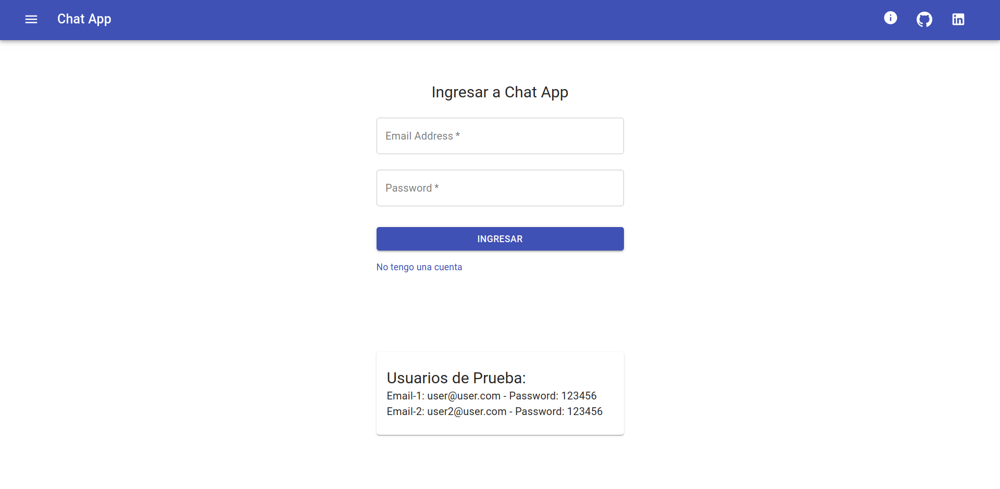
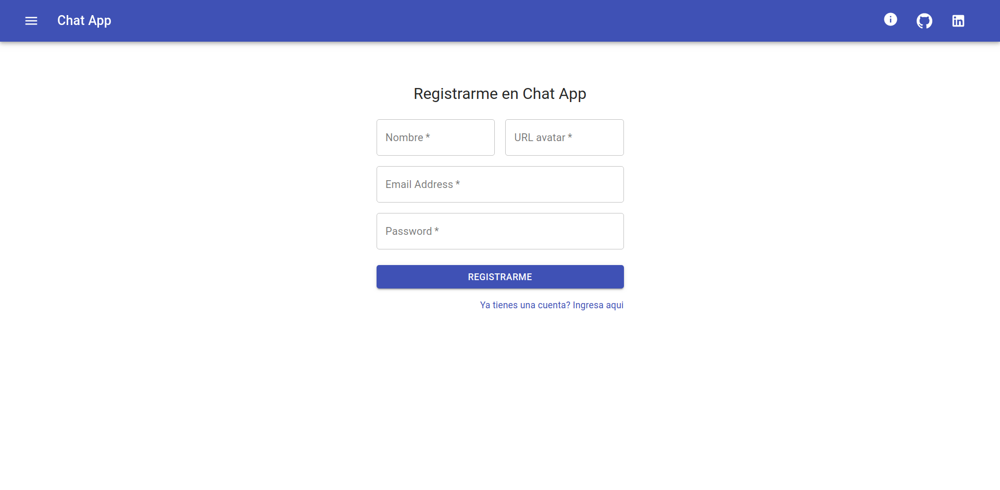
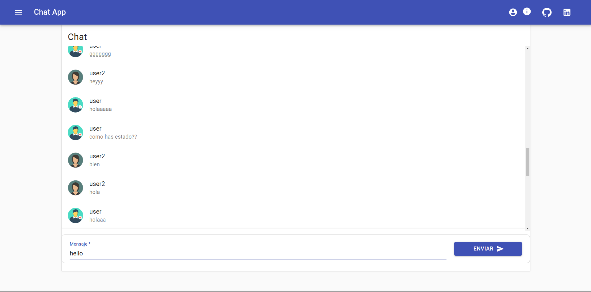

# Real Time web Chat with ReatJS and Firebase

A simple real-time chat app. Two or more users can interact with each other with their corresponding profile, if they don't have one, they can register a new profile.

# React Project

This project was bootstrapped with [Create React App](https://github.com/facebook/create-react-app).

In the project director you can run

### `npm start`

Runs the app in the development mode. 
Open [http://localhost:3000](http://localhost:3000) to view it in the browser.

# Development technologies

- [ReactJS](https://reactjs.org/)
- [Firebase](https://firebase.google.com/)
- [Material-UI](https://material-ui.com/)
- [React Router Dom](https://www.npmjs.com/package/react-router-dom)

# Images

- Login to enter the app

- User register

- Chat Where users interact

